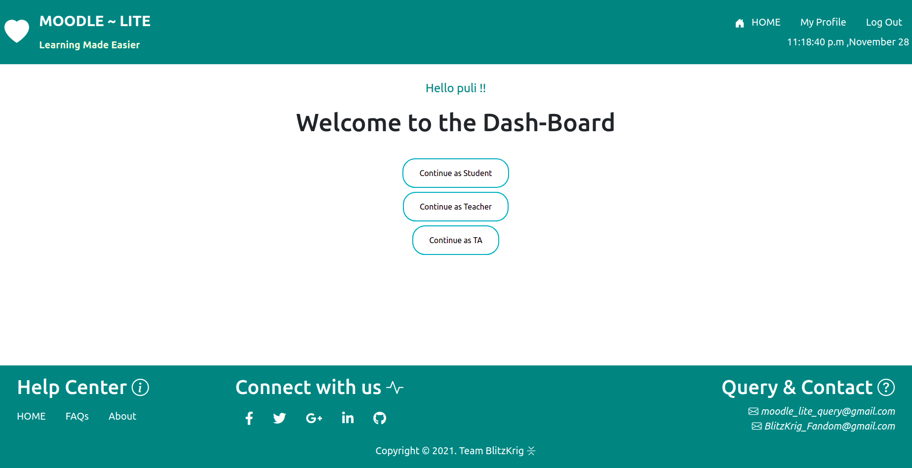
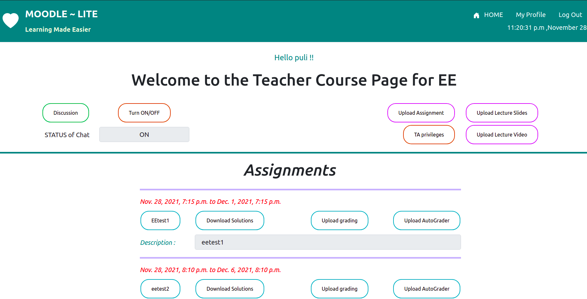
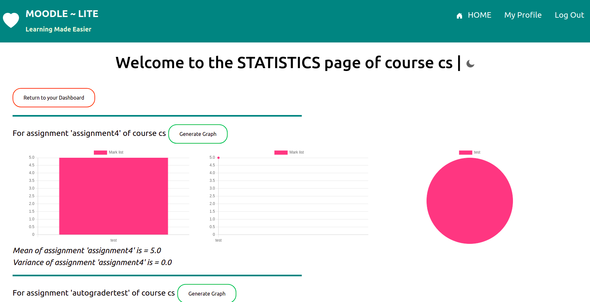
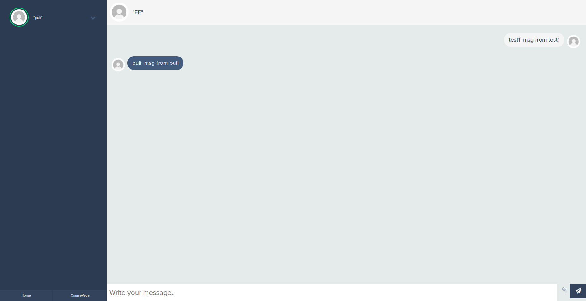

# Float-Moodle


## Table of Contents
* [General Info](#general-information)
* [Technologies Used](#technologies-used)
* [Features](#features)
* [Screenshots](#screenshots)
* [Setup](#setup)
* [Project Status](#project-status)
* [Room for Improvement](#room-for-improvement)
* [Acknowledgements](#acknowledgements)
* [Contact](#contact)
<!-- * [License](#license) -->


## General Information
- This project is a good start towards the development of widely used Moodle platform
- Moodle is an interactive and learning platform for students and teachers
- It is part of project in Software Systems Laboratory under professor Amitabha A.Sanyal


## Technologies Used
- Languages: Python, javascript, html
- Backend: Django
- Frontend: Bootstrap, css, html, javascript


## Features
### SignUp:
- New users can sign up. When signing up, the user must provide their mail ID which will be used for email based verification and also for important updates

### Login:
- The registered users can login only after their mail is verified

### Common Dashboard:
- Each user can see three options in this common dashboard, continue as student, continue as teacher, continue as TA

### Student Dashboard:
- The user when continued as a student can see the courses he is enrolled in as a student

### Teacher Dashboard:
- The user when continued as a teacher can see the courses he is enrolled in as a teacher
- Add Person: Teacher can add an user either as a student or TA to his course

### TA Dashboard:
- The user when continued as a TA can see the courses he is enrolled in as a TA

### Course page (Student's view):
#### Course discussion forum:
- Students, TAs and Teachers can discuss about the courses under this forum and can post their queries
- All the users involved in the course can see the ongoing discussion and reply in it 
#### Percentage of course completed:
- Percentage of course completed is displayed for each course !!!!!!!!!!!
#### Assignments:
- Student can download the assignment uploaded by Teacher (or TA)
- The deadline for assignment submission is also displayed
- He can upload his solution to the assignment any number of times before deadline
- He will be able to see feedback, grade if teacher uploads grading
- If the teacher uploads an autograde script, he can evaluate his solution and check feedback, grade
#### Lecture slides:
-Student will be able to access all the lectures slides uploaded by the teacher till date
#### Lecture videos:
- Student will be able to access all the lectures videos uploaded by the teacher till date
#### To-Do List:
- The To-Do list at the bottom of the page displays all the pending events student need to do

### Course page (Teacher's view):
#### Course discussion forum:
- Students, TAs and Teachers can discuss about the courses under this forum and can post their queries
- All the users involved in the course can see the ongoing discussion and reply in it 
- The teacher can decide to disable the discussion forum when needed using the Turn ON/OFF button
#### Upload Assignment: 
- Teacher can upload assignments with pre-mentioned start time and deadline 
    
#### Upload Lecture Slides:
- Teacher can upload slides related to the course which can be seen in the course page
    
#### Upload Lecture Videos:
- Teacher can upload videos related to the course which can be seen in the course page

#### TA Privileges: 
- Teacher has the option to change the privileges of each TA

Under each assignment, he can download all the solutions submitted, he can upload grading file in csv format. He can also upload autograding script which the student can use to evaluate his solution only after the deadline

### Course page (TA's view):
#### Course discussion forum:
- Students, TAs and Teachers can discuss about the courses under this forum and can post their queries
- All the users involved in the course can see the ongoing discussion and reply in it

The below mentioned features can be accessed by the TA depending upon his privileges
#### Upload Assignment: 
- TA can upload assignments with pre-mentioned start time and deadline 
Under each assignment, he can download all the solutions submitted, he can upload grading file in csv format. He can also upload autograding script which the student can use to evaluate his solution only after the deadline

#### Add Person:
- TA can add an user either as a student or TA to the course

### Calendar:
- All the users can access calendar from their dashboard and can see the past, present and upcoming events

### Private Chat:
- An user can chat with any other user of the platform

### Statistics:
- Teacher or TA can view the statistics of a particular course or all the courses combined
- Under a particular course, they can view statistics of each assignment such as mean, standard deviation
- They can also view cumulative performance of the class in the course till date

## Screenshots
### Common Dashboard:

### Teacher Course Page:

### Course Statistics:

### Communication:

<!-- If you have screenshots you'd like to share, include them here. -->


## Setup
- Create an environment for this project
  ```
	sudo apt install python3.8-venv
	python3 -m venv project-env
	source project-env/bin/activate
  ```
- Download the files from this repository
  ```
	cd mysite
	pip install -r requirements.txt
  ```
- If not installed, install redis-server using ```sudo apt install redis-server```
- In another terminal, run the redis-server using command ```redis-server```
-	Setup a database
-	Add Database details in .env file in the format specified in .env file of this repository
- To run the server,
  ```
    python3 manage.py collectstatic
    python3 manage.py makemigrations
    python3 manage.py migrate
    python3 manage.py runserver
  ```
- Open local host(127.0.0.1:8000) now, server will be up and running

## Project Status
- This project is complete


## Room for Improvement
### Implementing CLI: 
- A command line interface can be provided. Using this command line tool, students should be able to do all the
		important stuff like submitting an assignment, checking grades or
		deadline for an assignment, fetching files uploaded for an assignment
		by the Teacher and fetching grades.
### Notifications: 
- Notifying students about the updates in courses, Instructor messages.

## Acknowledgements
Give credit here.
- This project was inspired by the official Moodle that we use so frequently but rarely ponder over the nuances of its features.
- It was based on [so many tutorials](https://easytutorialspro.com/).
- Many thanks to all the web-blogs, stacks-overflow, stack-Exchange websites that we visited un-countable times.
- And we acknowledge and congragulate ourselves (these 4 sophies), who worked together, making the Team Blitzkrig come to existance.


## Contact

-	200050010@iitb.ac.in
-	200050020@iitb.ac.in
-	200050028@iitb.ac.in
-	200050112@iitb.ac.in

